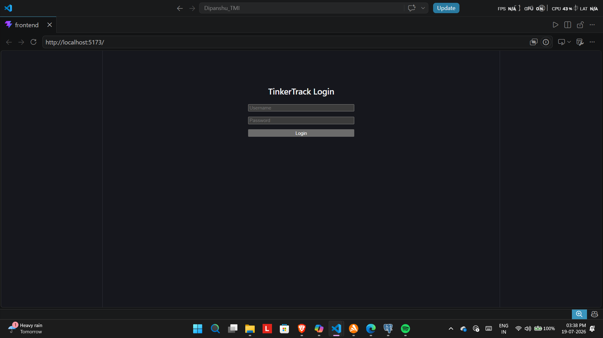
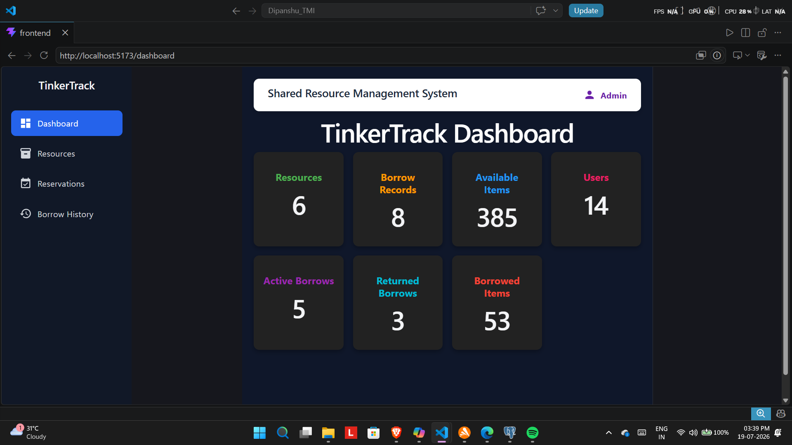
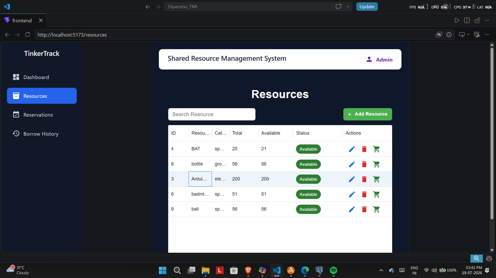
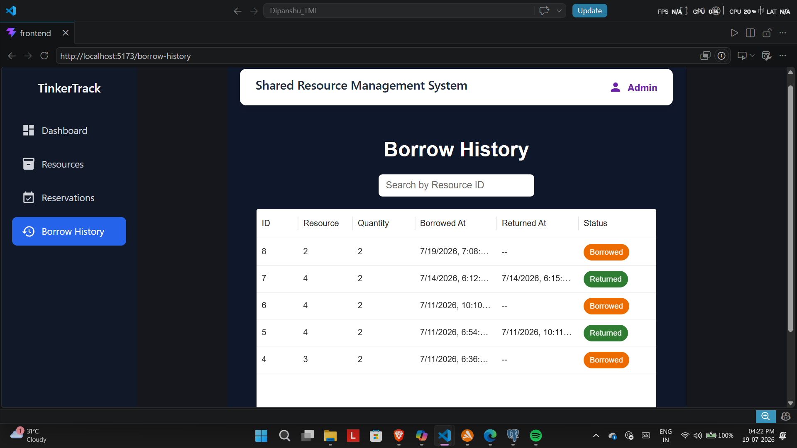
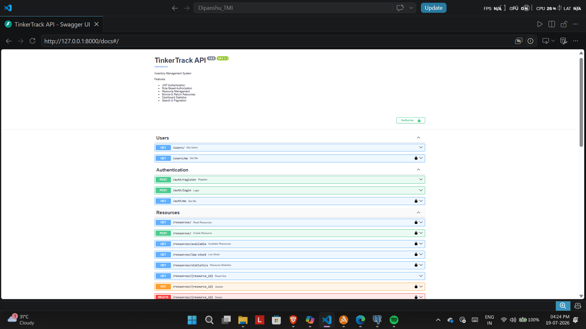
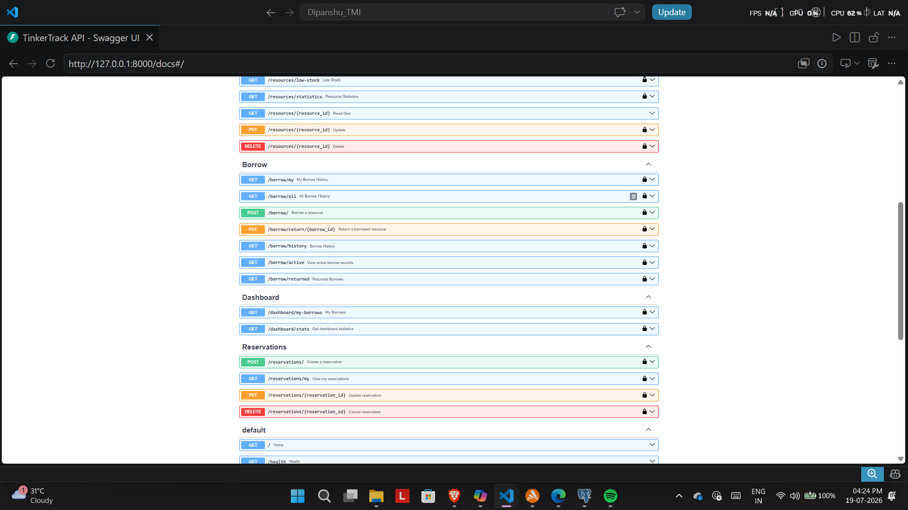
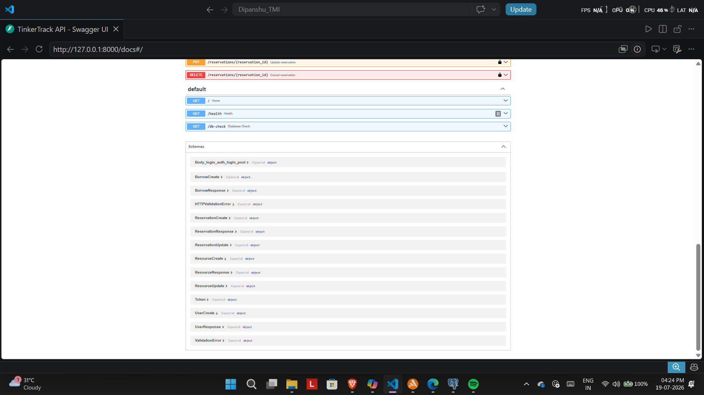

#  TinkerTrack – Shared Resource Management System

A full-stack web application for managing and tracking shared organizational resources such as laptops, projectors, books, laboratory equipment, and other assets.

TinkerTrack enables administrators to manage inventory while allowing users to borrow and reserve resources efficiently through a modern web interface.

---

#  Overview

Managing shared resources manually often leads to conflicts, inaccurate inventory tracking, and inefficient resource allocation.

TinkerTrack digitizes this process by providing:

* Secure user authentication
* Resource inventory management
* Borrow and return tracking
* Resource reservation
* Administrative dashboard
* Real-time inventory updates

---

#  Features

##  Authentication

* JWT-based authentication
* Secure password hashing using bcrypt
* Role-based authorization (Admin/User)

##  Resource Management

* Add resources
* Edit resources
* Delete resources
* View all available resources
* Automatic inventory updates

##  Borrow Management

* Borrow available resources
* Return borrowed resources
* View borrow history
* Track active borrow records

##  Reservation System

* Reserve resources
* View reservations
* Manage reservation records

##  Dashboard

* Total Resources
* Active Borrows
* Reservations
* Inventory statistics

---

#  Tech Stack

## Backend

* FastAPI
* SQLAlchemy
* PostgreSQL
* Alembic
* Pydantic
* JWT Authentication
* Passlib (bcrypt)

## Frontend

* React
* Material UI (MUI)
* Axios
* React Router

## Development Tools

* Git
* GitHub
* VS Code
* Swagger UI

---

#  Project Architecture

```text
React Frontend
        │
        ▼
Axios API Calls
        │
        ▼
FastAPI Backend
        │
        ▼
Service Layer
        │
        ▼
SQLAlchemy ORM
        │
        ▼
PostgreSQL Database
```

---

#  Project Structure

```text
tinkertrack/
│
├── backend/
│   ├── alembic/
│   ├── app/
│   │   ├── core/
│   │   ├── database/
│   │   ├── models/
│   │   ├── routers/
│   │   ├── schemas/
│   │   ├── services/
│   │   └── main.py
│
├── frontend/
│   ├── public/
│   ├── src/
│   │   ├── api/
│   │   ├── components/
│   │   ├── pages/
│   │   └── App.jsx
│
└── README.md
```

---

#  Installation

## Clone Repository

```bash
git clone https://github.com/dipanshu-bot/tinkertrack.git

cd tinkertrack
```

---

## Backend Setup

```bash
cd backend

python -m venv .venv

source .venv/bin/activate
# Windows
.venv\Scripts\activate

pip install -r requirements.txt

alembic upgrade head

uvicorn app.main:app --reload
```

Backend runs on:

```text
http://127.0.0.1:8000
```

Swagger Documentation:

```text
http://127.0.0.1:8000/docs
```

---

## Frontend Setup

```bash
cd frontend

npm install

npm run dev
```

Frontend runs on:

```text
http://localhost:5173
```

---

#  API Modules

## Authentication

* Login
* Register
* JWT Authentication

## Resources

* Create Resource
* View Resources
* Update Resource
* Delete Resource

## Borrow

* Borrow Resource
* Return Resource
* Borrow History

## Reservation

* Create Reservation
* View Reservations

## Dashboard

* Resource Statistics
* Borrow Statistics
* Reservation Statistics

---

#  Security Features

* JWT Authentication
* Password Hashing (bcrypt)
* Role-Based Authorization
* Request Validation using Pydantic
* SQLAlchemy ORM to safely interact with the database

---

#  Screenshots

Add screenshots of:

# Screenshots

### Login Page


### Dashboard


### Resources


### Borrow Module


### Reservation Module


### Swagger Documentation

### Swagger Documentation

### Swagger Documentation



---

#  Demo Video

Demonstration Video:

(Add your YouTube or Drive link here.)

---

#  Future Improvements

* Email notifications
* QR Code based resource checkout
* Fine calculation for overdue returns
* Analytics dashboard
* Resource image uploads
* Search and filtering
* Pagination
* Real-time notifications

---

#  Author

**Dipanshu Yadav**

B.Tech Civil Engineering
Indian Institute of Technology Roorkee

GitHub:
https://github.com/dipanshu-bot

---

#  License

This project is licensed under the MIT License.
